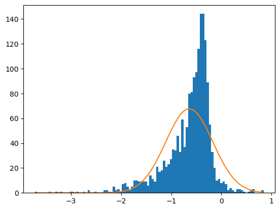
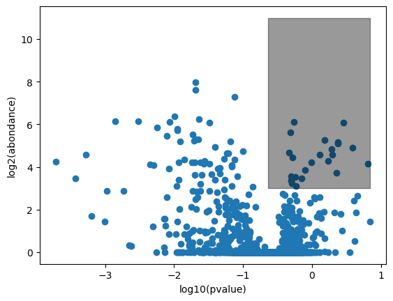
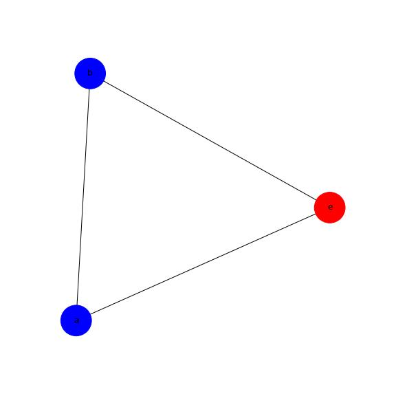

# TP de Protéomique MADP 2022
## Contexte Biologique
Vous allez utiliser des outils informatiques qui vous permettront d’analyser des données brutes issues d’une analyse Shotgun Proteomics récemment publiée dans le journal Science sous le titre "Real-time visualization of drug resistance acquisition by horizontal gene transfer reveals a new role for AcrAB-TolC multidrug efflux pump".

Les données associées à cette publication sont publiques et accessibles sur la plateforme [PRIDE](https://www.ebi.ac.uk/pride/archive/projects/PXD011286). Le PDF de la publication est [`data/Nolivos_2019.pdf`](data/Nolivos_2019.pdf).


## Mise en place

### Méthodologie

Vous forkerez le présent "repository" pour vous permettre de sauvegarder votre travail.
Vous le clonerez ensuite dans votre espace de travail.
Vous éditerez ce fichier `README.md` pour répondre aux questions dans les encarts prévus à cet effet et inserer les figures que vous aurez générées. Ce "repository" vous appartenant, vous pouvez créer tous les repertoires et fichiers necessaires à la conduite du TP.

### Ressources

Seul le langage Python (v3.X) est requis pour ce travail.
Il vous est conseillé d'installer un environnement virtuel python pour installer les libraries requises independamment de votre systèmes d'exploitation.

* Le systême de gestion de paquets [Conda](https://docs.conda.io/en/latest/) est très pratique et disponible pour la plupat des systèmes d'exploitation. Une version légère suffisante pour nos besoin est téléchargeable [ici](https://docs.conda.io/en/latest/miniconda.html)
* Si vous disposez d'un interpreteur python 3.X installé sur votre systême [virtualenv](https://docs.python.org/3/library/venv.html) est désormais "built-in" (cf. Procédure virtualenv).

#### Procédure conda

Depuis le repertoire de votre repository Git, installez le package scipy et lancez jupyter.

```sh
$PATH_TO_CONDA_DIR/bin/conda install -c conda-forge scipy notebook matplotlib
$PATH_TO_CONDA_DIR/bin/jupyter notebook
```
#### Procédure Master BIOINFO LYON1
Votre compte du master vous donne accès à une instance **JupyterHub** sur pédago service: `http://pedago-service.univ-lyon1.fr:8000`
#### Procédure virtualenv

Créer l'environnement virtuel.

```python -m venv MADP_TP```

Activer l'environnement virtuel et installer les packages.

```
source MADP_TP1/bin/activate
pip install --user ipykernel scipy notebook matplotlib
```
#### Procédure VM IFB

Une "appliance" IFB a été préparée avec les dépendances Python requises.
Elle est accessible [ici](https://biosphere.france-bioinformatique.fr/catalogue/appliance/160/).
Jupyter vous permettra d'ouvrir des terminaux SHELL et des notebook Python.
Le repertoire racine de Jupyter est `/mnt/mydatalocal/`


#### Intégration des environnements au notebook

Il peut être pratique d'ajouter votre environnement à Jupyter. Cela se réalise depuis l'environnement (conda ou venv) activé.

```
python -m ipykernel install --user --name=MADP_TP
```


Jupyter est une environnement de type notebook permettant l'exécution de code python dans des cellules avec une persitance des variables entre chaque évaluation de cellule. Jupyter fournit nativement le support de la librarie graphique matplotlib.

### Test de l'installation

Dans l'interface de jupyter, créez un nouveau fichier notebook (*.ipynb) localisé dans votre repertoire git.
Dans la première cellule copiez le code suivant:

```python
%matplotlib inline
import matplotlib.pyplot as plt
import numpy as np
from scipy.stats import norm
```

La première ligne sert à activer le rendu graphique, pour tout le fichier notebook. Pour **dessiner des graphiques**, il vous est conseillé de suivre la méthode illustrée par le code suivant que vous pouvez executer dans une deuxième cellule notebook.

```python
fig, ax = plt.subplots()
x = np.linspace(norm.ppf(0.01),
                norm.ppf(0.99), 100)

ax.plot(x, norm.pdf(x),
       'r-', lw=5, alpha=0.6)

ax.plot(x, np.full(len(x), 0.2),
       'b-', lw=1)

fig.show()
```

* Creation des objets `fig`et `ax`
* Ajout successif de graphiques sur la même figure par l'appel à des methodes de l'objet `ax`
* Affichage de la figure complète via `fig.show()`
* Evaluation de la cellule pour visualisation dans la cellule de résultats.

L'affichage dans la cellule de rendu du notebook devrait confirmer la bonne installation des dépendances.

#### On entend par figure un graphique avec des **axes légendés et un titre**.

La documentation matplotlib est bien faite, mais **attention** il vous est demandé, pour la construction des graphiques, **d'ignorer les méthodes de l'objet `plt`** (frequemment proposées sur le net) et d'utiliser uniquement les méthodes de l'[objet Axes](https://matplotlib.org/api/axes_api.html?highlight=axe#plotting). `plt` est un objet global susceptible d'agir simultanement sur tous les graphiques d'un notebook. A ce stade, son utilisation est donc à éviter.

## Données disponibles

### Mesures experimentales

Un fichier `data/TCL_wt1.tsv` contient les données d'abondances differentielles mesurées sur une souche sauvage d'*Escherichia coli* entre deux conditions: avec Tetracycline et en milieu riche. Le contrôle est le milieu riche.

| Accession | Description | Gene Symbol  |   Corrected Abundance ratio (1.53)    | Log2 Corrected Abundance Ratio | Abundance Ratio Adj. P-Value |   -LOG10 Adj.P-val |
| --- | --- | --- | --- | --- | --- | ---|
| [Accesseur Uniprot](https://www.uniprot.org/help/accession_numbers)  | Texte libre | Texte libre  |  $\frac{ \text{WildType}\_{\text{Tc}} }{ \text{WildType}\_{\text{rich}} }$ |$Log_2(\frac{\text{WildType}\_{\text{Tc}}}{\text{WildType}\_{\text{rich}}})$  | $\mathbb{R}^{+}$ |  $\mathbb{R}^{+}$  |

<!-- | [Accesseur Uniprot](https://www.uniprot.org/help/accession_numbers)  | Texte libre | Texte libre  |  |   |  |   | -->


Attention certaines valeurs numériques sont manquantes ou erronées, constatez par vous même en parcourant rapidement le fichier.

### Fiches uniprot

Les fiches de toutes les protéines de *E.coli* sont stockées dans un seul document XML `data/uniprot-proteome_UP000000625.xml`. Nous allons extraire de ce fichier les informations dont nous aurons besoin, à l'aide du module de la librarie standard [XML.etree](https://docs.python.org/3/library/xml.etree.elementtree.html#module-xml.etree.ElementTree). Pour vous facilitez la tâche, les exemples suivants vous sont fournis. Prenez le temps de les executer et de les modifier dans un notebook. Vous vous familliariserez ainsi avec la structure du document XML que vous pouvez egalement inspecter dans un navigateur.

```python
from xml.etree.ElementTree import parse, dump
# Parse the E.Coli proteome XML Document
tree = parse('data/uniprot-proteome_UP000000625.xml')
root = tree.getroot()
ns = '{http://uniprot.org/uniprot}' # MANDATORY PREFIX FOR ANY SEARCH within document
# Store all entries aka proteins in a list of xml nodes
proteins = root.findall(ns + 'entry')
# Display the xml subtree of the first protein 
dump(proteins[0])
```

```python
# Find the xml subtree of a protein with accession "P31224"
for entry in proteins:
    accessions = entry.findall(ns+"accession")
    for acc in accessions:
        if acc.text == "P31224":
            dump(entry)
            break
```

<!-- Cherchez par exemple le sous arbre de la protéine nommée `DACD_ECOLI` -->

### Statistiques de termes GO

Les nombres d'occurences de tous les termes GO trouvés dans le protéome de E.coli sont stockés dans le fichier `data/EColiK12_GOcounts.json`. Ces statistiques ont été dérivées du fichier `data/uniprot-proteome_UP000000625.xml`.

## Objectifs

1. Manipuler les données experimentales tabulées
2. Representer graphiquement les données d'abondance
3. Construire la pvalue des fonctions biologiques (termes GO) portées par les protéines surabondantes
4. Visualiser interactivement les pathways plus enrichis.

### Description statistique des Fold Change
La lecture des données au format tabulé est l'occasion de se familliariser avec la [librairie pandas](https://pandas.pydata.org).

##### Lecture de données

###### source:`data/TCL_wt1.tsv`

La fonction `read_csv` accepte différents [arguments](https://pandas.pydata.org/pandas-docs/stable/reference/api/pandas.read_csv.html) de format de données très utiles.

```python
df = pandas.read_csv()
```

Quel est le type de l'objet `df`?
```
pandas.core.frame.DataFrame

```

##### Descriptions d'une table de données
Que permettent les méthodes suivantes?
###### df.shape
```
Return a tuple representing the dimensionality of the DataFrame.
```
###### df.head()
```
The first n rows of the caller object.
```
###### df.tail()
```
Returns the last n rows.
```
###### df.columns
```
The column labels of the DataFrame.
```
###### df.dtypes
```
Return the dtypes in the DataFrame.
```
###### df.info
```
Return a summary of the DataFrame
```
###### df.describe()
```
Generate descriptive statistics.
```
###### df.dropna()
```
Remove missing values.
```

##### Accès aux éléments d'une table de données

```python
values = df[['Description', 'Gene Symbol']]
```

Quel est le type de `values` ?

Verifiez si certaines méthodes de `DataFrame` lui sont applicables.
Ce type supporte l'accès par indice et les slice `[a:b]`

##### Accès indicé

On peut accéder aux valeurs du DataFrame via des indices ou plages d'indice. La structure se comporte alors comme une matrice. La cellule en haut et à gauche est de coordonnées (0,0).
Il y a différentes manières de le faire, l'utilisation de `.iloc[slice_ligne,slice_colonne]` constitue une des solutions les plus simples. N'oublions pas que shape permet d'obtenir les dimensions (lignes et colonnes) du DataFrame.
###### Acceder aux cinq premières lignes de toutes les colonnes
```python
cinq_prem_col = df.iloc[0:5,:]

```

###### Acceder à toutes les lignes de la dernière colonne
```python
dernier_ligne = df.iloc[0:5,-1]

```

###### Acceder aux cinq premières lignes des colonnes 0, 2 et 3
```python
colomns = df.iloc[0:5, [0,2,3]]
```

##### Conversion de type

Le type des valeurs d'une colonne peut être spécifiée:

* à la lecture

```python
pandas.read_csv('data/TCL_wt1.tsv', sep="\t",  dtype = {'Accession': str, 'Description': str, 'Gene Symbol': str, 
                                                 'Corrected Abundance ratio (1.53)': np.float,  'Log2 Corrected Abundance Ratio': np.float, 
                                                 'Abundance Ratio Adj. P-Value: (127. T3 Tc WT) / (126. T0 WT)': np.float, '-LOG10 Adj.P-val': np.float})
```

* modifiée à la volée

```python
df = df.astype({'Log2 Corrected Abundance Ratio': float, '-LOG10 Adj.P-val': float } )
```

On peut specifier la chaine de caractères correspondant au valeurs "incorrectes" produites par excel comme-ci

```python
pandas.read_csv('data/TCL_wt1.tsv', sep="\t", na_values="#VALEUR!")
```
##### Selection avec contraintes
La méthode `loc` permet de selectionner toutes les lignes/colonnes respectant certaines contraintes

* Contraintes de valeurs continues

```python
df.loc[(df['-LOG10 Adj.P-val'] > 0 )  & (df['Log2 Corrected Abundance Ratio'] > 0.0 ) ]
```

* Contraintes de valeurs discrètes

```python
df.loc[ df['Gene Symbol'].isin(['fadR', 'arcA'] ) ]
```


#### Appliquons ces outils à l'analyse de données protéomique

##### 1. Charger le contenu du fichier `data/TCL_wt1.tsv` dans un notebook en eliminant les lignes porteuses de valeurs numériques aberrantes

##### 2. Representez par un histogramme les valeurs de `Log2 Corrected Abundance Ratio`

<!-- ##### 3. A partir de cette échantillon de ratio d'abondance,  estimez la moyenne  et l'ecart-type  d'une loi normale. -->

##### 3. A partir de cette échantillon de ratio d'abondance,  estimez la moyenne $\mu$ et l'ecart-type $\sigma$ d'une loi normale.
```
log = df['Log2 Corrected Abundance Ratio']
mu = np.mean(df.iloc[:,4])
sigma = np.std(df.iloc[:,4])

```

##### 4. Superposez la densité de probabilité de cette loi sur l'histogramme. Attention, la densité de probabilité devra être mis à l'echelle de l'histogramme (cf ci-dessous)


```python
# _ est le vecteur des valeurs d'abondance
fig, ax = plt.subplots()
hist = ax.hist(_, bins=100) # draw histogram
x = np.linspace(min(_), max(_), 100) # generate PDF domain points
dx = hist[1][1] - hist[1][0] # Get single value bar height
scale = len(_)*dx # scale accordingly
ax.plot(x, norm.pdf(x, mu, sigma)*scale) # compute theoritical PDF and draw it
```



##### 5. Quelles remarques peut-on faire à l'observation de l'histogramme et de la loi théorique?

```


```

#### Construction d'un volcano plot

##### A l'aide de la méthode [scatter](https://matplotlib.org/3.1.1/api/_as_gen/matplotlib.axes.Axes.scatter.html) representer $\text{Log}_{10}({\text{p-value}}) = f(\text{Log}_2(\text{abundance ratio}))$

##### Matérialisez le quadrant des protéines surabondantes, par deux droites ou un rectangle
Sont condidérées comme surabondantes les proteines remplissant ces deux critères:

* $\text{Log}_2(\text{abundance ratio})\gt\mu%2B\sigma$
* $\text{p-value}<0.001$



### Analyse Fonctionelle de pathway

Nous allons implementer une approche ORA (Over Representation Analysis) naive.

##### 1. Retrouver les entrées du fichier TSV des protéines surabondantes

Quelles sont leurs identifiants UNIPROT ?
``` 


```

#### 2. Lister les termes GO portés par ces protéines surabondates

Les `entry` du fichier `data/uniprot-proteome_UP000000625.xml` présentent des balises de ce type:

```xml
<dbReference type="GO" id="GO:0005737">
<property type="term" value="C:cytoplasm"/>
<property type="evidence" value="ECO:0000501"/>
<property type="project" value="UniProtKB-SubCell"/>
</dbReference>
```

Pour vous aider à obtenir la liste des termes GO des protéines surabondantes, voici la fonction `getAccessionGOTerms(xml_file, uniprotID)`
qui extrait du fichier de protéome uniprot xml fourni en 1er argument les termes GO portés par la protéine au code uniprot fourni en deuxième argument.

```python
from xml.etree.ElementTree import parse, dump

def getAccessionGOTerms(xmlFile, accession):
    tree = parse(xmlFile)
    root = tree.getroot()
    ns = '{http://uniprot.org/uniprot}'
    
    match_go_terms = []
    proteins = root.findall(ns + 'entry')
    for entry in proteins:
        accessions = entry.findall(ns+"accession")
        current_accessions = [ acc.text for acc in accessions ]
        if not accession in current_accessions:
            continue
        goTerms = entry.findall('{http://uniprot.org/uniprot}dbReference[@type="GO"]')
        #goTerms = xmlEntry.findall(ns +'dbReference[@type="GO"]')
        for goT in goTerms:
            gID   = goT.attrib['id']
            gName = goT.find(ns +'property[@type="term"]').attrib['value']
            match_go_terms.append((gID, gName))
        break
    return match_go_terms
getAccessionGOTerms("./data/uniprot-proteome_UP000000625.xml", "P0A8V6")
```
A l'aide de cette fonction, il devrait être possible de construire le dictonnaire des termes GO de toutes les protéines surabondantes précedemment identifiées.
Ce dictionnaire pourrait être de la forme suivante:
```python
{'GO:0005829': {'ID'        : 'GO:0005829',
                'name'      : 'C:cytosol',
                'carried_by': ['P0A8V6', 'P0A9Q1', 'P02358', 'P0ACF8', 'P62399', 'P76344']
                },
 'GO:0003677': {'ID'        : 'GO:0003677',
                'name'      : 'F:DNA binding',
                'carried_by': ['P0A8V6', 'P0ACF8']
                }
  }
```
Vous implémenterez la construction de ce dictionnaire et ainsi stockerez, pour la suite de l'analyse, les représentations des termes GO parmi les protéines surabondantes.

#### 3. Obtention des paramètres du modèle

Nous évaluerons la significativité de la présence de tous les termes GO portés par les protéines surabondantes à l'aide d'un [modèle hypergéometrique](https://docs.scipy.org/doc/scipy/reference/generated/scipy.stats.hypergeom.html).

Si k protéines surabondantes porte un terme GO, la pvalue de ce terme sera équivalente à  $P(X\ge k | X \sim H(k,K,n,N) )$

Completer le tableau ci-dessous avec les quantités vous semblant adéquates pour modeliser la pvalue de **chaque pathway [termes GO]**

| Symboles | Paramètres | Quantités Biologiques |
| --- | --- | --- |
| k | nombre de succès observés| |
| K | nombre de succès possibles| |
| n | nombre d'observations| |
| N | nombre d'elements observables| |

#### 4. Calcul de l'enrichissement en fonction biologiques

A l'aide du contenu de `data/EColiK12_GOcounts.json` parametrez la loi hypergeometrique et calculez la pvalue
de chaque terme GO portés par les protéines surabondantes. Vous reporterez ces données dans le tableau ci-dessous

| identifiant GO | définition | occurence | pvalue|
|---|---|---|---|
|   |   |   |   |

Quelle interpretation biologique faites-vous de cet enrichissement en termes GO ?


### Analyse des interactions répertoriées dans STRING

#### Chargement des données dans STRING

Dans le menu de gauche, sélectionner 'Multiple proteins'.

Copier-coller les identifiants Uniprot des 
protéines sur-exprimées et spécifier l'organisme 'Escherichia coli K-12".

Valider le mapping produit par STRING en clickant sur 'Continue'.


#### Visualisation du réseau dans STRING


Combien d'interactions contient ce réseau ?

```


```


Faire varier les paramètres de visualisation du réseau dans 'Settings' pour afficher le réseau fonctionnel
ou physique avec différents indices de confiance.


Combien d'interactions sont supportées par chaque source ('Textmining', 'Experiments', 'Databases','Co-expression',
'Neighborhood', 'Gene Fusion', 'Co-occurence') ?

Hint: l'onglet Analysis, donne accès aux nombre des interactions du réseau.
```


```

#### Analyse du réseau des protéines sur-exprimées dans le contexte du réseau global.

Consulter la rubrique 'Network Stats' dans l'onglet Analysis. 

Que peut-on en conclure sur les interactions de ce petit ensemble de protéines ?
```


```

Afin de replacer ces protéines dans le contexte du réseau d'interaction global de E. coli, 
ajouter les interacteurs de la première et de la deuxième couche.

Que pouvez-vous en déduire sur les mécanismes activés par la présente de tétracycline ?
```


```
#### Analyse de sur-représentation des termes GO

Consulter l'analyse de sur-représention des termes GO présents dans l'onglet 'Analysis'.
Est-ce cohérent avec votre analyse précédente ?

```


```


### Construction de réseaux d'interactions à partir de données MITAB.

Le format (MITAB) stocke des paires de protéines en interaction. Dans ce format, chaque colonne porte une information spécifique.
Une description du format est disponible [ici](https://psicquic.github.io/MITAB27Format.html).
Les données d'interactions impliquant les protéines surreprésentées de l'expérience ont été obtenues depuis la base de données [Intact](https://www.ebi.ac.uk/intact/home).
Ces données sont mises à votre disposition dans le fichier `data/proteins.mitab`.

Vous extrairez du fichier les paires d'identifiants uniprot des protéines en interaction.

Ces paires de protéines constituent un réseau d'interaction protéine-protéine que vous allez dessiner à l'aide de la libraire [networkx](https://networkx.org/documentation/stable/reference).
Le code suivant vous est fourni à titre d'exemple.

```python
%matplotlib inline
import matplotlib.pyplot as plt
import networkx as nx
G = nx.Graph()

fig, ax = plt.subplots(figsize=(8, 8))

G.add_edge('a', 'b')
G.add_edge('e', 'b')
G.add_edge('e', 'a')
pos = nx.spring_layout(G)
nx.draw(G, pos, with_labels=True, node_color=['blue','blue','red'] , node_size=2000)
```



Les positions des noeuds sont paramétrables au travers de l'objet [layout](https://networkx.org/documentation/stable/reference/generated/networkx.drawing.layout.spring_layout.html). Une fois une première représentation du réseau obtenue, affinez celle-ci afin de:

* colorier dans une couleur spécifique uniquement les protéines surabondantes dans l'expérience.
* Écrire les identifiants uniprot dans les noeuds du réseau.
* colorier les protéines appartenant à des classes GO communes.
* Faire du diamètre des noeuds une fonction du nombre de partenaires protéiques.
* N'afficher que les noeuds des protéines mesurées dans l'experience
* Utiliser une échelle de couleur continue fonction de l'abondance pour colorier les noeuds

